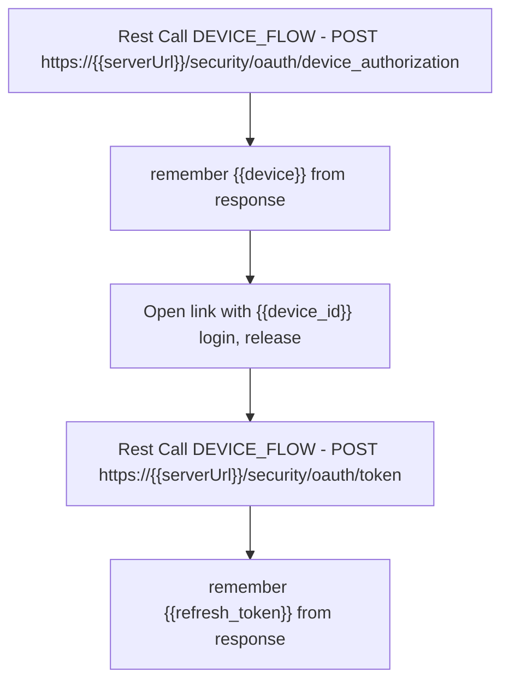

# parser form Homeconnect API for Washer for telegraf to influxDB

## intro

for using this tool you need `client_id` from your homeconnect developer application
I use in application settings **device flow** way and the genered `refresh_token`

For generate the refresh_token please a rest tool like postman and take the following step



config.yaml 
``` 
base_url: https://api.home-connect.com
login:
  refresh_token: jujJyZWdpb24iO.....
  client_id: AAF0EA107717AC7E30....
```