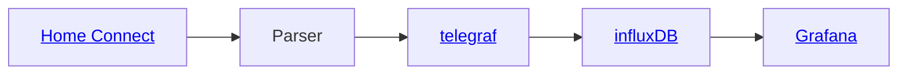
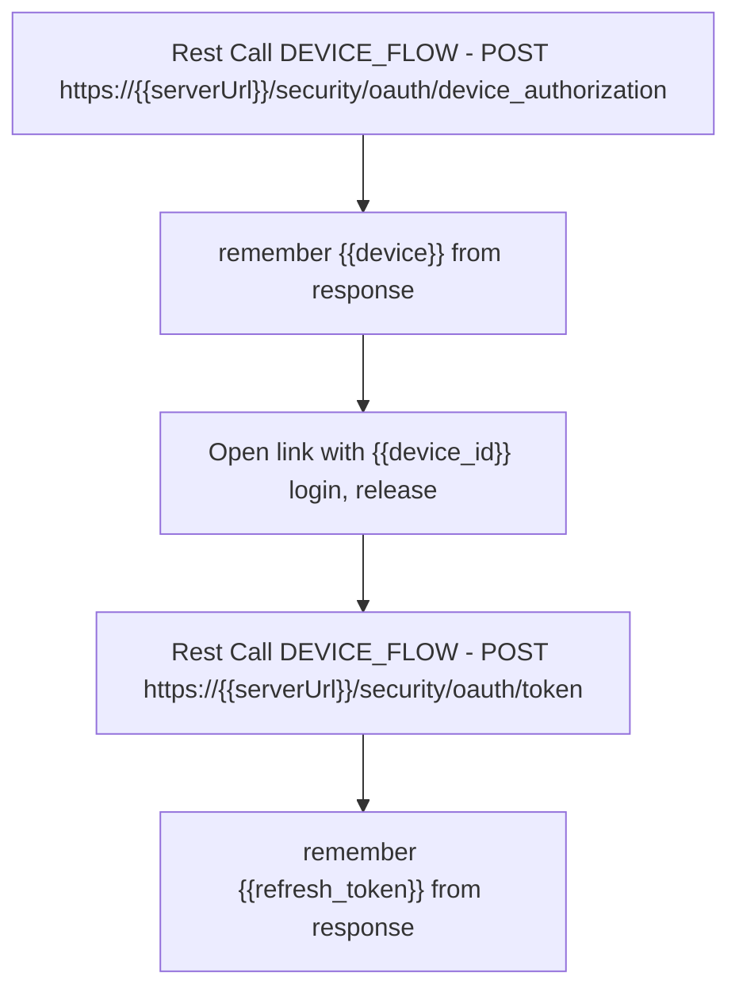

# parser form Homeconnect API for Washer for telegraf to influxDB

## goal

The goal here is to collect data from Homeconnect API and show charts in Grafana


## intro

For using this tool you need `client_id` from your homeconnect developer application
I use in application settings **device flow** way and the generated `refresh_token`

For generate the refresh_token please a rest tool like postman and take the following step



config.yaml 
``` 
base_url: https://api.home-connect.com
login:
  refresh_token: jujJyZWdpb24iO.....
  client_id: AAF0EA107717AC7E30....
```

## usage

just call script with:

``python homeconnect_2_telegraf_main.py -t washer``

### in telegraf config

```
[[inputs.exec]]
  commands = ["python3.8 path_to_scrip/home-connect_2_telegraf_main -t WASHER"]
  timeout = "150s"
  interval = "120s"
  data_format = "json"
  name_override = "washers"
  tag_keys = ["brand", "enumber", "haId", "name", "type", "vib"]
  json_string_fields = ["v_door_status", "v_active_status", "v_programs_active_process_phase"]
```